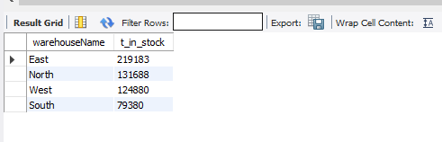
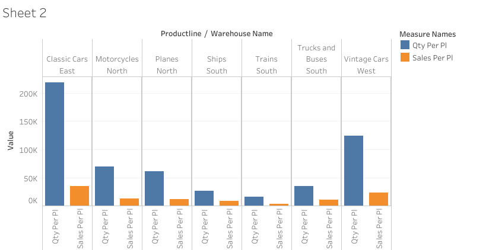
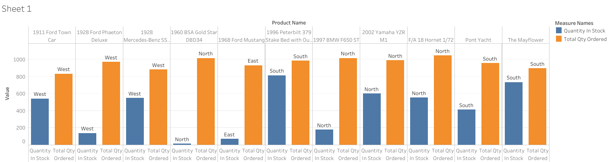
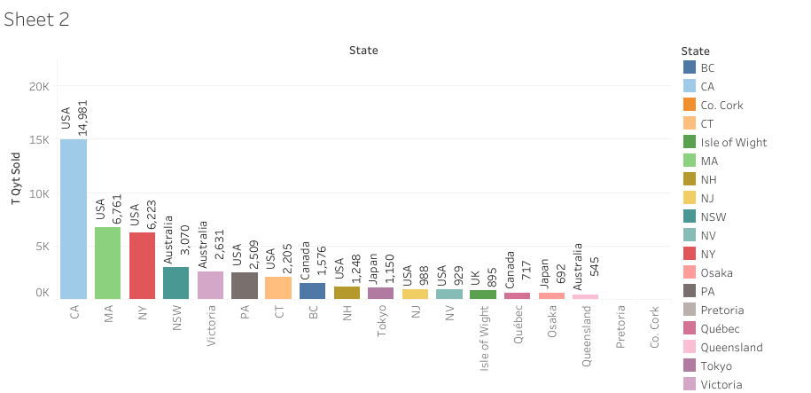
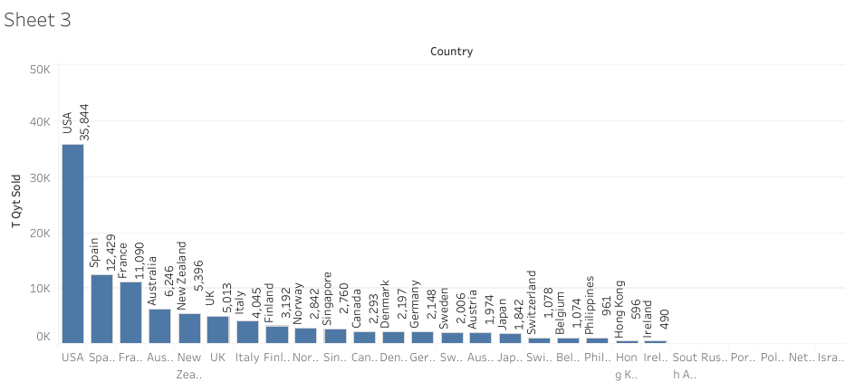
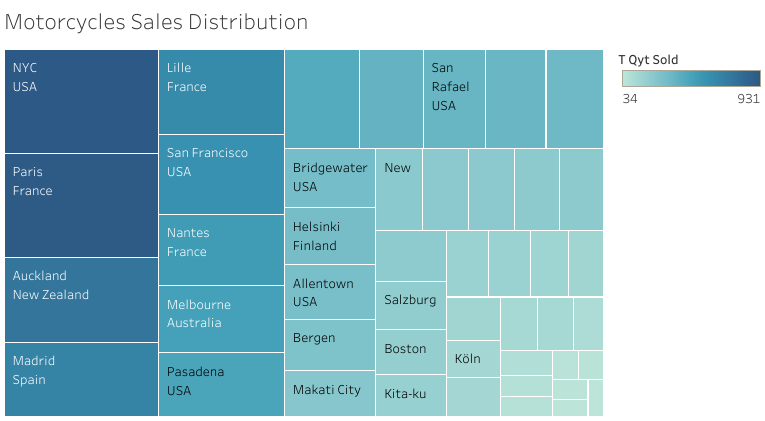

# Introduction
Dive intp Mint Classic (a retailer of classic model cars and other vehicles) sales data, to provide suggestions and recommendations for reorganizing or reducing inventory. Also, they need to close one of thier storage facilities if possible to reduce expences.

# Background
To support a data-based business decision, the company wants to have insights about thier inventory and if they need inventory reducing. They want to have answers to the questions like:
1. Where are items stored and if they were rearranged, could a warehouse be eliminated?
2. How are inventory numbers related to sales figures? Do the inventory counts seem appropriate for each item?

# Project Objectives
1. Explore products currently in inventory.
2. Determine important factors that may influence inventory reorganization/reduction.
3. Provide analytic insights and data-driven recommendations.

# Tools I used
To can dive into the company data and analyze it, I used:
1. SQL: The main tool of my analysis, to can query the data and find insights.
2. MYSQL: The chosen database management.
3. Tableau: For Data Visualization.

# The Analysis
1.Total quantity in stock for each storage facility.
```sql
select
	wh.warehouseName,
  sum(p.quantityInStock) as t_in_stock
FROM
    products AS p
LEFT JOIN
    warehouses AS wh ON p.warehouseCode = wh.warehouseCode
GROUP BY
    wh.warehouseName
ORDER BY
    t_in_stock DESC;
```


2. Total quantity in each storage facility or warehouse with the product line and the total sales related to each warehouse. With this analysis we can find the number of sales accourding to the inventory to have an over view and if we can apply inventory reduction or rearrange items.


* Bar graph visualizing the total quantity in each warehouse according to productline, as the graph shows that most of the sales numbers are less than the inventory numbers with big diffrence.

3. Determine which items that have more orders than the quantity in stock to keep them from reduction.
```sql
CREATE TEMPORARY TABLE  salestable 
    select 
    productCode,
    sum(quantityOrdered) as total_qty_ordered
    from orderdetails
    GROUP BY
    productCode;
select 
    p.productName,
    p.productCode,
    p.quantityInStock,
    p.productline,
    wh.warehouseName,
    st.total_qty_ordered
FROM
    products AS p
LEFT JOIN
    warehouses AS wh ON p.warehouseCode = wh.warehouseCode
LEFT JOIN
    salestable st ON p.productCode = st.productCode
WHERE
    p.quantityInStock < st.total_qty_ordered;
```

*The Bar graph shows the number of orderes are more than the quantity in each warehouse, we can keep them from inventory reduction and increase the quantities for more sales.

5. Determine where are the most sales in America and other countries.
```sql
CREATE TEMPORARY TABLE  table3 
select 
    pd.productLine,
    od.productCode,
    od.quantityOrdered,
    o.customerNumber
from 
	orderdetails as od
left join
	orders o on od.orderNumber = o.orderNumber
left join
	products pd on od.productCode = pd.productCode;
select
    c.state,
    c.country,
    sum(quantityOrdered) as t_qyt_sold
From
	customers c
left join
	table3 t3 on c.customerNumber = t3.customerNumber
where 
	state is not null
group by
	1,2
order by 
	t_qyt_sold Desc;
```

* The graph shows that most of the sales are in the west and east states (especially (California-CA) where it has the most sales)in USA and the other states are outside USA which will be presented better in the next graph as the whole sales for each country.


* The graph shows that most of sales are in the USA(west and east states) and Westren Europe countries like Spain. With thease insights we can analyze North or south warehouses to see if we can reduce the inventory and relocate the items to West or East warehouses.

6. Anlayze the sales distrbution for north warehouse data for Planes and Motorcycles.

```sql
CREATE TEMPORARY TABLE  table3 
select 
    pd.productLine,
    od.productCode,
    od.quantityOrdered,
    o.customerNumber
from 
	orderdetails as od
left join
	orders o on od.orderNumber = o.orderNumber
left join
	products pd on od.productCode = pd.productCode;
```


[Visualization Link](https://public.tableau.com/views/SalesDistributionforNorthWarehouse/Sheet1?:language=en-US&:sid=&:redirect=auth&:display_count=n&:origin=viz_share_link)
* The graph shows that most of the orders are from USA(west and east states) and Westren Europe countries

# Conclusions and Recommendation
1. There are big differnce between the number of orders and the quantities of items in each warehouse, we recommend to reduce the inventory for most of the items.
2. As for the items that sales are more than the quantities in the warehouses we recommend to increase the inventory of thease items for more sales.
3. Most of the orders are from West and East states in the USA, Western Eourpe Contries such as: UK, Spain and Italy
4. AS shown in the analysis above we recommend to reduce the inventory for East and West warehouses for most of productline items and provide space for items in the North warehouse to rearrange.
5. We recommend to relocate the Motercycles productline after reducing the inventory to West and East Warehouse, while increasing the inventory for the East warehouse to be more than the West one as the orders are more in the East warehouse to cover east states and Western Europe Countries.
6. The company can close the North the storge spaces for the Motorcycles productline and provide small space for North orders like the ones coming from Canada as it can be 50 items and to determine which type of motorcycles to relocate based on orders distination check the table link:
[motercycles sales with product code](motorcycle_sales_with_productcode.csv) to determine the product code for each item.

